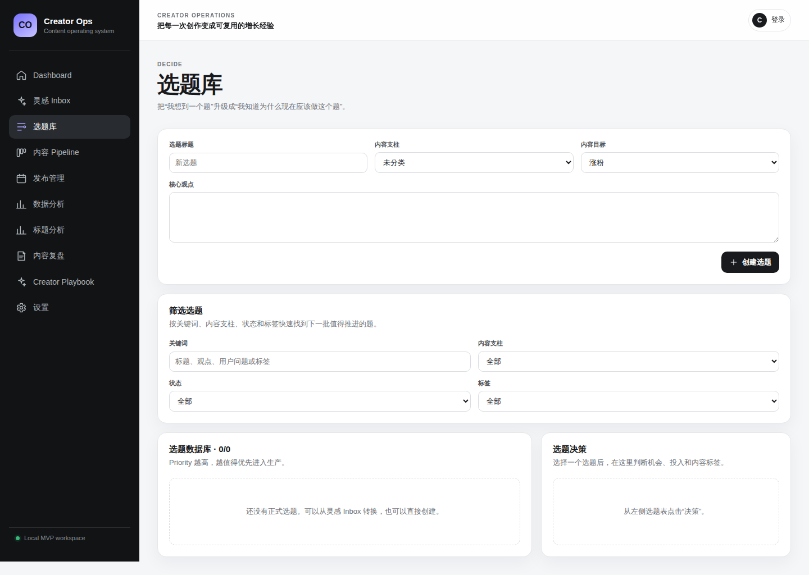
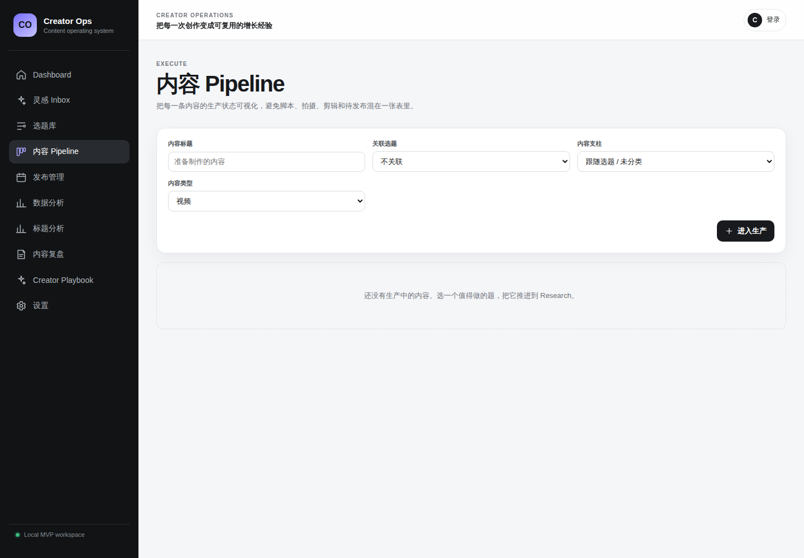
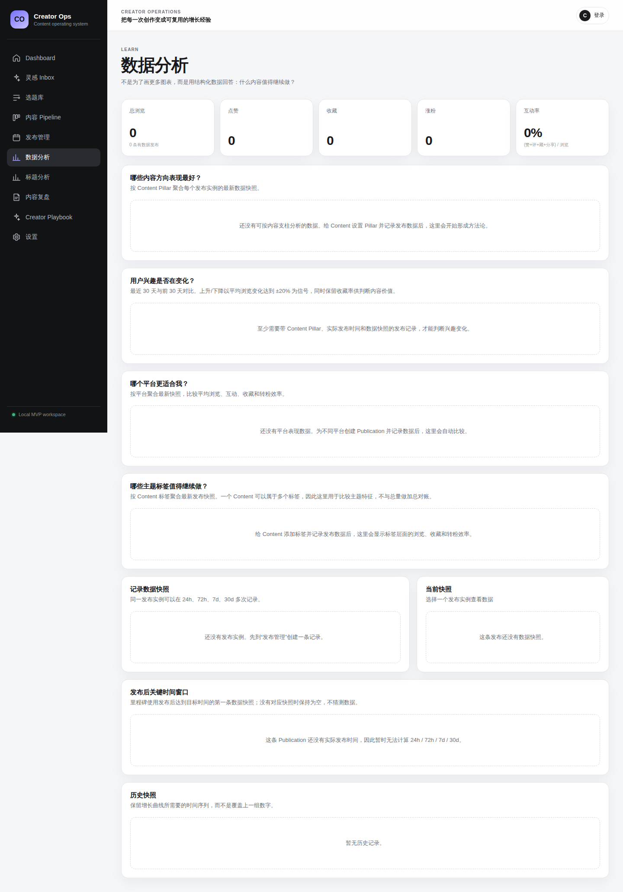

# Creator Ops

> An open-source creator operations workspace — from idea to insight.

Creator Ops helps individual creators and small content teams manage the full content production loop in one place:

**Inspiration → Topic → Content → Publication → Metrics → Review → Insight → Better next topic**

It is intentionally not another generic Notion-style database. Creator Ops understands the domain relationship between a topic, a reusable content asset, each platform-specific publication, its time-series metrics, the review produced from those results, and the reusable creator knowledge that should influence the next decision.

**Latest release:** [Creator Ops v0.1.0](https://github.com/QuinnyAc/creator-ops/releases/tag/v0.1.0)

**Explore:** [Product Tour](docs/product-tour.md) · [60-second demo](#60-second-demo) · [Codespaces](docs/codespaces.md) · [Deployment](docs/deployment.md) · [API](docs/api.md)

## Why Creator Ops

Generic databases are excellent at storing rows. Creator Ops is opinionated about the creator workflow:

- capture an idea with almost no friction;
- decide whether a topic is worth making before production starts;
- manage a content lifecycle instead of a generic task lifecycle;
- separate reusable `Content` from each platform-specific `Publication`;
- preserve metric snapshots instead of overwriting yesterday's numbers;
- compare Content Pillars, Tags, platforms, title patterns, and recent interest changes;
- rank the next topics using both human judgment and the creator's own performance evidence;
- turn a one-off review into a reusable Creator Playbook insight.

## Product screenshots

Screenshots below are generated from the real application using the repository's reproducible demo dataset.

### Decide what to make next



### Operate the production pipeline



### Learn from performance



See the [full Product Tour](docs/product-tour.md) for Dashboard, publishing calendar, analytics, and Creator Playbook screenshots.

## 60-second demo

Requirements: Docker with Compose support.

```bash
cp .env.example .env
docker compose up --build -d
make demo
```

Open `http://localhost:3000`.

The demo seed is development-only and intentionally populates a realistic creator workspace with:

- Inspiration Inbox items;
- scored Topics and Tags;
- multiple Content Pillars;
- content in published, review, script, and ready stages;
- Xiaohongshu, Bilibili, WeChat Official Accounts, and YouTube accounts;
- cross-platform Publications and a scheduled item;
- time-series MetricSnapshots;
- data that produces meaningful platform, tag, title, and trend analytics;
- Reviews and a Creator Playbook Insight.

Running `make demo` again is safe: the seed is idempotent. CI executes it twice on PostgreSQL to verify that property.

To delete all local data and start again:

```bash
make reset
```

### Browser-hosted demo environment

Creator Ops also ships a GitHub Dev Container. From the repository page choose **Code → Codespaces → Create codespace**, then run `make dev` and `make demo`. Open forwarded port `3000` to use the same workspace in your browser. See [GitHub Codespaces](docs/codespaces.md).

## Current MVP

The repository includes a working end-to-end product foundation for:

- low-friction Inspiration Inbox with conversion into Topics;
- searchable Topic Library with weighted opportunity / priority scoring;
- Content Pillars and Tags for stable strategy + flexible taxonomy;
- evidence-backed next-topic recommendations with transparent score adjustments;
- content production Kanban and per-content workspace;
- multi-platform creator accounts and Publication management;
- monthly publishing calendar;
- manual metric snapshots and 24h / 72h / 7d / 30d milestones;
- bulk CSV metric import with idempotent snapshot upserts;
- CSV exports for Topics, Content, Publications, Reviews, and Playbook Insights;
- Content Pillar performance comparisons;
- recent-vs-previous Content Pillar interest trend signals;
- platform performance comparisons;
- Tag performance analytics;
- title-pattern analysis for packaging learnings;
- structured content Reviews;
- transparent data-assisted review suggestions against the creator's own baseline;
- Creator Playbook / reusable Insights promoted from Review learnings;
- dashboard summaries and evidence-backed topic recommendations;
- email/password registration and JWT authentication;
- tenant-isolated creator-owned data boundaries;
- development and production Docker stacks;
- PostgreSQL backup / clean-schema restore tooling with a real CI restore proof;
- reproducible npm installs with a committed lockfile and high-severity audit gate;
- PostgreSQL migrations, GitHub Actions CI, CodeQL, Dependabot, and release automation.

Initial platform catalog:

- Xiaohongshu
- Bilibili
- WeChat Official Accounts
- YouTube

## Product loop

```text
Inspiration
    ↓
Topic + Score
    ↓
Evidence-backed recommendation
    ↓
Content Workspace
    ↓
Publication(s)
    ↓
Metric Snapshots
    ↓
Analytics + Review
    ↓
Creator Playbook Insight
    ↓
Better next Topic
```

A single `Content` can have multiple `Publication` records. The same core idea can therefore be adapted to several platforms with different titles, schedules, links, and performance data without losing the relationship to the original content asset.

## Analytics philosophy

Creator Ops avoids dashboards that only report vanity totals. The analytics layer is designed to answer operational questions:

- Which Content Pillars perform best?
- Is audience interest in a Content Pillar rising or falling?
- Which Tags correlate with stronger outcomes?
- Which platform is more efficient for this creator?
- Which title patterns correlate with stronger outcomes?
- Did this Content beat the creator's own baseline?
- Which scored Topic has the strongest combination of intent and historical evidence?
- What should change in the next iteration?

The first review assistant and topic recommendation engine are deliberately rule-based and transparent. They do not require a proprietary LLM to create useful feedback, and they never overwrite the creator's judgment without an explicit action.

## Tech stack

| Layer | Choice |
| --- | --- |
| Web | Next.js + React + TypeScript |
| API | FastAPI + Python |
| Database | PostgreSQL |
| ORM / migrations | SQLAlchemy + Alembic |
| Authentication | Argon2 password hashing + signed JWT |
| Local runtime | Docker Compose |
| Production packaging | Multi-stage Docker images + production Compose |
| CI / security | GitHub Actions + CodeQL + npm audit + Dependabot |

## Repository structure

```text
creator-ops/
├── apps/
│   ├── web/                 # Next.js creator workspace
│   └── api/                 # FastAPI REST API
├── scripts/                 # database backup / restore operations
├── docs/                    # product, architecture, API and operations docs
├── .devcontainer/           # GitHub Codespaces environment
├── .github/                 # CI, security, release and contribution automation
├── docker-compose.yml       # development stack
├── docker-compose.prod.yml  # production-style stack
├── Makefile
├── .env.example
├── .env.production.example
├── LICENSE
└── README.md
```

## Run locally

```bash
cp .env.example .env
docker compose up --build
```

Then open:

- Creator workspace: `http://localhost:3000`
- Login / registration: `http://localhost:3000/login`
- API: `http://localhost:8000`
- Swagger API docs: `http://localhost:8000/docs`
- Health check: `http://localhost:8000/health`

The API container applies `alembic upgrade head` before starting.

Local development defaults to the seeded creator identity, so the workflow can be explored without authentication setup. You can also create a real account on `/login`; the web client attaches the returned Bearer token automatically.

## Run without Docker

Backend:

```bash
cd apps/api
python -m venv .venv
source .venv/bin/activate
pip install -e ".[dev]"
alembic upgrade head
uvicorn app.main:app --reload
```

Frontend:

```bash
cd apps/web
npm ci
npm run dev
```

## Test and release gates

Backend:

```bash
cd apps/api
pytest
```

Frontend:

```bash
cd apps/web
npm ci
npm audit --audit-level=high
npm run typecheck
npm run build
```

GitHub automation protects the release with:

1. **Backend CI** — Python compilation, Alembic upgrade → downgrade → upgrade, pytest, and demo seed idempotence.
2. **Frontend CI** — reproducible `npm ci`, high-severity dependency audit, TypeScript typecheck, and Next.js production build.
3. **Production containers** — production Compose validation plus API and Web image builds.
4. **CodeQL** — static security scanning.
5. **Backup restore smoke** — a real PostgreSQL backup → mutation → clean-schema restore → verification cycle.

## Production-style deployment

Create a production environment file:

```bash
cp .env.production.example .env.production
```

Replace every placeholder secret and public URL, then validate and build:

```bash
make prod-config
make prod-build
make prod-up
```

The production stack:

- disables the development user fallback;
- requires a strong PostgreSQL password and JWT secret;
- runs the API without reload and as a non-root user;
- uses multiple Uvicorn workers by default;
- builds Next.js standalone output;
- does not expose PostgreSQL to the host;
- includes service health checks;
- runs Alembic migrations before the API starts.

See [Production deployment](docs/deployment.md) for the full checklist.

## Backup and restore

Create a PostgreSQL custom-format backup:

```bash
make backup
```

Restore requires an explicit backup path and confirmation guard:

```bash
make restore BACKUP=backups/creator-ops-YYYYMMDDTHHMMSSZ.dump
```

The restore path stops application writes, recreates the PostgreSQL `public` schema, restores the historical dump, and restarts application services. See [PostgreSQL backup and restore](docs/backups.md) before using it on production data.

## Data ownership

Creator Ops is designed as an open-source system of record, not a data trap. The Settings page can export the creator's core operational data as UTF-8 CSV. Metric snapshots can also be bulk-imported from CSV, allowing a spreadsheet or platform export to act as a bridge before direct platform integrations are available.

## Production authentication

A public deployment must use safe production settings:

```env
APP_ENV=production
ALLOW_DEV_USER_FALLBACK=false
JWT_SECRET_KEY=<strong-random-secret>
NEXT_PUBLIC_REQUIRE_AUTH=true
```

The API refuses to boot in production with unsafe development authentication defaults.

## Documentation

- [Product Tour](docs/product-tour.md)
- [Architecture](docs/architecture.md)
- [Database design](docs/database.md)
- [API overview](docs/api.md)
- [Production deployment](docs/deployment.md)
- [PostgreSQL backup and restore](docs/backups.md)
- [GitHub Codespaces](docs/codespaces.md)
- [Security model](docs/security-model.md)
- [Brand direction](docs/branding.md)
- [v0.1.0 release checklist](docs/release-checklist.md)
- [Contributing](CONTRIBUTING.md)
- [Security policy](SECURITY.md)

## Roadmap

### P0 — workflow MVP

- [x] Inspiration Inbox
- [x] Topic scoring
- [x] Content Pipeline
- [x] Content Workspace
- [x] Publication management
- [x] Manual analytics snapshots
- [x] Structured Reviews
- [x] Dashboard
- [x] Authentication foundation
- [x] End-to-end Creator Loop integration test

### P1 — creator analytics and decision support

- [x] Content Pillar performance comparisons
- [x] Content Pillar interest trend signals
- [x] Platform performance comparisons
- [x] Tag performance analytics
- [x] 24h / 72h / 7d / 30d performance views
- [x] Publishing calendar view
- [x] Topic / Content Tag relationships
- [x] Title pattern analysis
- [x] CSV metric import and operational data export
- [x] Data-assisted Review suggestions
- [x] Evidence-backed next-Topic recommendations
- [x] Expanded API integration coverage
- [x] Development demo dataset
- [x] Production container validation in CI

### P2 — creator intelligence

- [x] Creator Playbook / reusable Insights foundation
- [ ] Official platform data integrations
- [ ] Optional LLM-assisted Review using Creator Playbook context
- [ ] AI-assisted Topic evaluation grounded in creator evidence
- [ ] Automated Insight confidence / validation over time
- [ ] Team collaboration and roles
- [ ] Browser extension and automation hooks

P2 items are intentionally post-v0.1.0. The open-source release does not depend on proprietary platform APIs or an LLM to complete the core creator operations loop.

## Open source

Creator Ops is released under the [MIT License](LICENSE).

Commercial hosting and advanced managed features can be built on top of the open-source core without changing the goal of keeping the essential creator workflow self-hostable.
