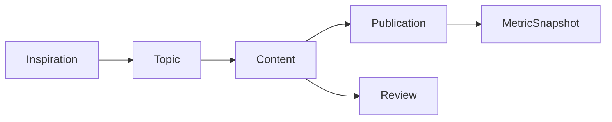
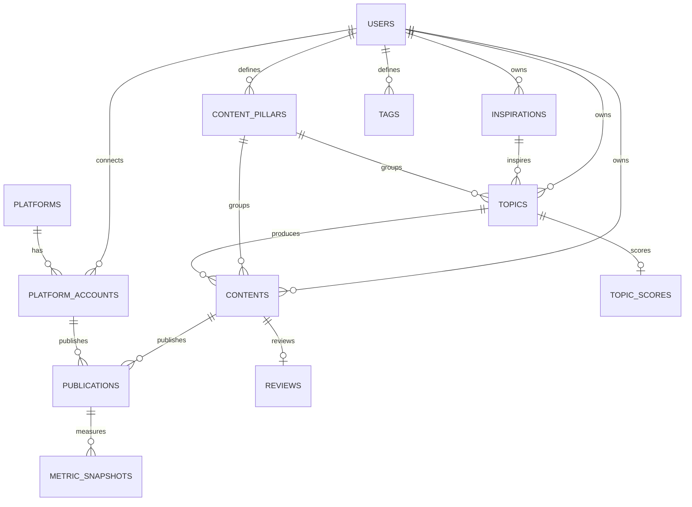

# Database Design

Creator Ops uses PostgreSQL as the system of record. The schema follows the content operations loop instead of mirroring a generic project-management database.

## Core domain chain

A `Content` is the reusable content asset. A `Publication` is one platform-specific publishing instance. This distinction lets one video or article be adapted to Xiaohongshu, Bilibili, WeChat Official Accounts, and YouTube without duplicating the production workspace.

## Entity overview

## Tables

### `users`
Creator identity and user-level preferences. Authentication is intentionally deferred from the first schema iteration.

### `inspirations`
Low-friction inbox entries. Inspirations can later become one or more structured topics.

### `content_pillars`
Stable strategic content categories such as AI Tools, Product Management, or Career Growth. Analytics should prefer pillars over ad-hoc tags for longitudinal comparisons.

### `topics`
Structured content opportunities containing the audience problem, angle, goal, status, and planned platforms.

### `topic_scores`
One-to-one scorecard for each topic. All six raw dimensions use a 1–5 scale. `opportunity_score` and `priority_score` are persisted so scoring rules can evolve without rewriting historical decisions.

Initial opportunity weights:

- pain point: 25%
- search demand: 20%
- trend heat: 15%
- differentiation: 20%
- commercial value: 20%

Production effort is kept separate and is used to discount priority rather than inflate opportunity.

### `contents`
The production workspace for research, outline, script, copywriting, CTA, and lifecycle status.

### `platforms`
Global platform catalog. Initial product targets are Xiaohongshu, Bilibili, WeChat Official Accounts, and YouTube.

### `platform_accounts`
A creator can connect multiple accounts on the same platform.

### `publications`
Platform-specific version of a content asset. It stores the platform title, copy, cover, tags, schedule, actual publish time, status, and URL.

### `metric_snapshots`
Time-series snapshots, not just the latest counters. This supports future 24h / 72h / 7d / 30d comparisons. Common metrics are columns; platform-specific values are stored in `extra_metrics`.

### `reviews`
Structured post-publication review attached to the core content asset: goal, expectation, strengths, weaknesses, learning, and next action.

### `tags`, `topic_tags`, `content_tags`
Flexible classification without replacing strategic content pillars.

## Design rules

1. A core content asset and a platform publication are different entities.
2. Platform analytics are measured at publication level.
3. Metrics are append-only snapshots so growth curves remain possible.
4. Content pillars are strategic; tags are descriptive.
5. AI-generated insights will be added after enough structured operational data exists.
