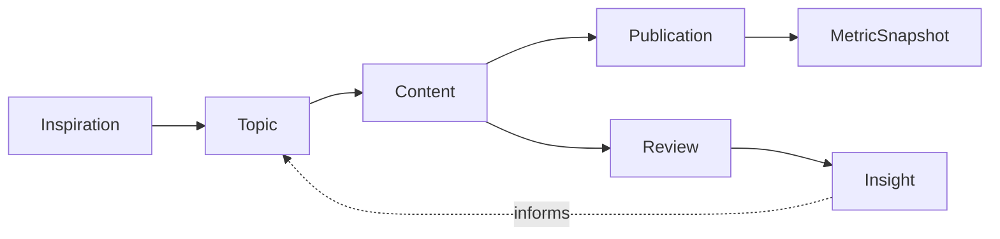
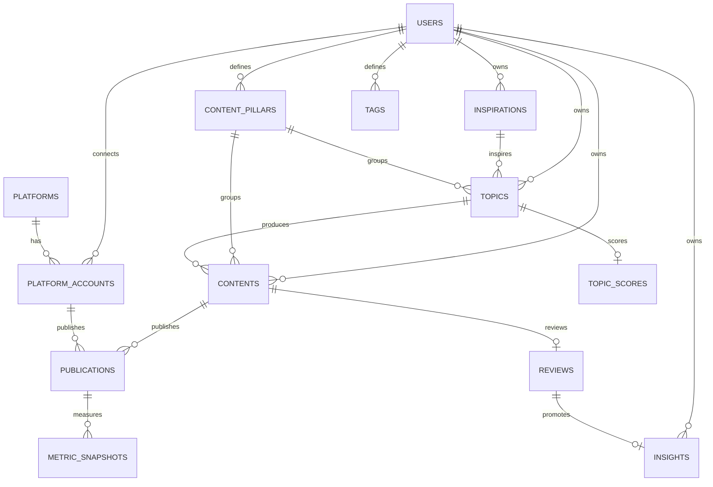

# Database Design

Creator Ops uses PostgreSQL as the system of record. The schema follows the content operations loop instead of mirroring a generic project-management database.

## Core domain chain

A `Content` is the reusable content asset. A `Publication` is one platform-specific publishing instance. This distinction lets one video or article be adapted to Xiaohongshu, Bilibili, WeChat Official Accounts, and YouTube without duplicating the production workspace.

## Entity overview

## Tables

### `users`
Creator identity, password hash, timezone, and user-level preferences. Passwords are stored as Argon2 hashes; API sessions use signed JWT access tokens.

### `inspirations`
Low-friction inbox entries. An Inspiration can be converted into a structured Topic while preserving its origin.

### `content_pillars`
Stable strategic content categories such as AI Tools, Product Management, or Career Growth. Analytics prefer pillars over ad-hoc tags for longitudinal comparisons.

### `topics`
Structured content opportunities containing the audience problem, angle, goal, status, and planned platforms.

### `topic_scores`
One-to-one scorecard for each Topic. All six raw dimensions use a 1–5 scale. `opportunity_score` and `priority_score` are persisted so scoring rules can evolve without rewriting historical decisions.

Initial opportunity weights:

- pain point: 25%
- search demand: 20%
- trend heat: 15%
- differentiation: 20%
- commercial value: 20%

Production effort is kept separate and discounts priority rather than inflating opportunity.

### `contents`
The reusable production workspace for research, outline, script, copywriting, CTA, planned publish time, and lifecycle status.

### `platforms`
Global platform catalog. Initial product targets are Xiaohongshu, Bilibili, WeChat Official Accounts, and YouTube.

### `platform_accounts`
Creator-owned accounts on a Platform. A user can manage multiple accounts on the same platform.

### `publications`
Platform-specific version of a Content asset. It stores the platform title, copy, cover, tags, schedule, actual publish time, status, and URL.

### `metric_snapshots`
Time-series snapshots rather than an overwritten latest counter. The uniqueness key is `(publication_id, captured_at)`, which also enables idempotent CSV imports. Common metrics are columns; platform-specific values are stored in `extra_metrics`.

The latest snapshot per Publication is used for aggregate analytics. Historical snapshots remain available for growth curves and milestone analysis.

### `reviews`
Structured post-publication review attached one-to-one to the core Content asset: goal, expectation, strengths, weaknesses, learning, and next action.

### `insights`
Creator Playbook knowledge. An Insight belongs to a user and can optionally point back to the Review that produced it.

`source_review_id` is unique, so repeatedly promoting the same Review refreshes one Insight rather than creating duplicates. Deleting a Review does not destroy the long-term learning: the foreign key uses `ON DELETE SET NULL`.

### `tags`, `topic_tags`, `content_tags`
Flexible classification without replacing strategic Content Pillars.

## Analytics derived from the schema

The relational model intentionally makes the following comparisons possible without duplicating content records:

- performance by Content Pillar;
- recent-vs-previous Content Pillar interest trends;
- performance by Platform;
- performance by title pattern;
- one Content's multi-platform aggregate versus the creator baseline;
- 24h / 72h / 7d / 30d Publication milestones;
- future Creator Playbook confidence scoring based on repeated evidence.

## Design rules

1. A core Content asset and a platform Publication are different entities.
2. Platform analytics are measured at Publication level.
3. Metrics are append-only snapshots so growth curves remain possible.
4. Content Pillars are strategic; Tags are descriptive.
5. Reviews record a single content iteration; Insights preserve reusable knowledge across iterations.
6. Creator-owned resources always carry or inherit a user ownership boundary.
7. AI features should consume structured operational data and Creator Playbook context rather than replace the underlying data model.
