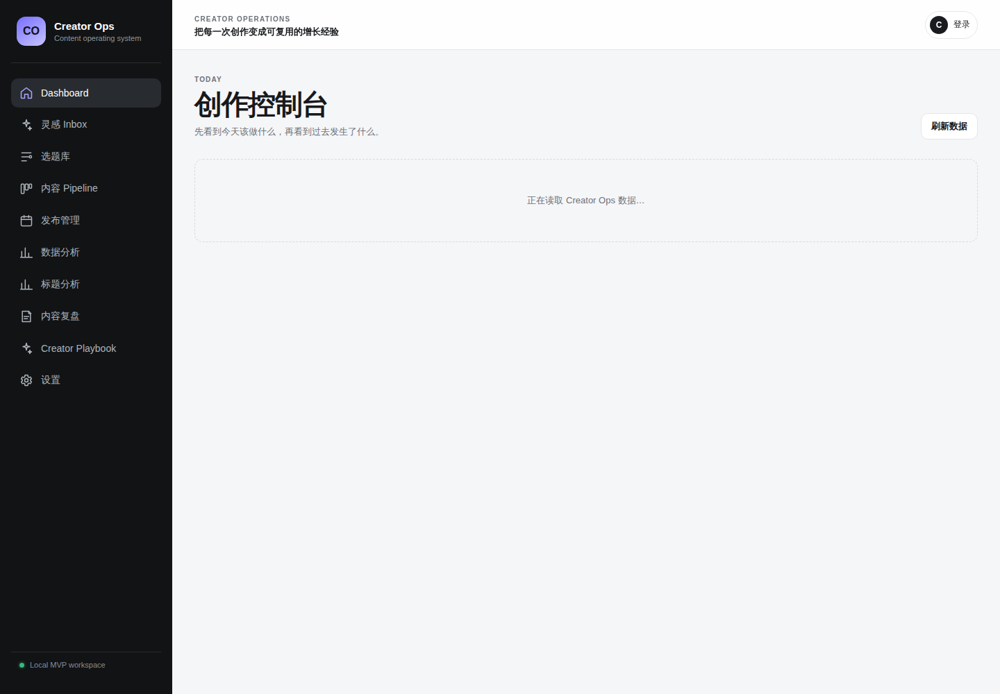
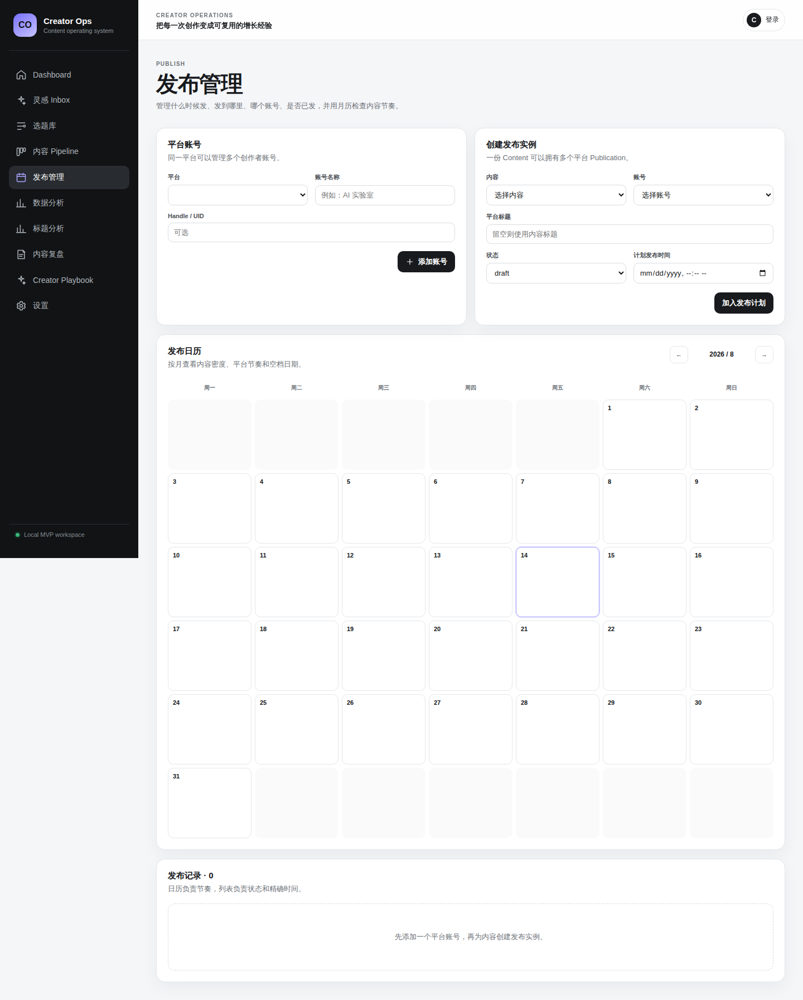
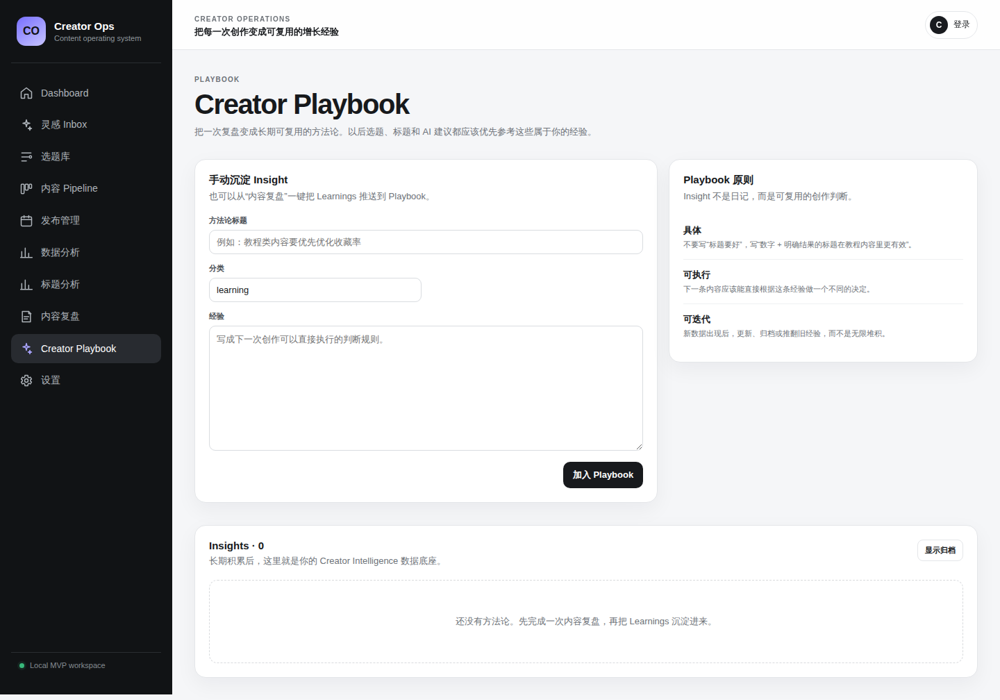

# Creator Ops Product Tour

Creator Ops is an open-source creator operations workspace built around one complete feedback loop:

**Inspiration → Topic → Content → Publication → Metrics → Review → Insight → Better next topic**

This tour uses screenshots captured from the real Next.js application with the repository's reproducible demo dataset.

## 1. Start with the work that matters now

The Dashboard is designed to answer **“What should I do next?”** rather than only showing vanity totals. It surfaces operational counts and evidence-backed next-topic recommendations so a creator can move directly into action.



## 2. Decide what is worth making

The Topic Library turns raw ideas into evaluated content opportunities. Topics can be organized with Content Pillars and Tags, searched and filtered, and ranked using a transparent weighted score plus evidence from the creator's own historical performance.


The product deliberately separates **Inspiration** from **Topic**: capture should stay low-friction, while evaluation should happen only after an idea becomes a real candidate for production.

## 3. Move content through a creator-native pipeline

Content is managed through a lifecycle that matches how creator work is actually produced:

`Research → Outline → Script → Shooting → Editing → Ready → Published → Review`


A Content item represents the reusable core asset. Platform-specific publication details are kept separately so one piece of Content can become several Publications without duplicating the creative work.

## 4. Plan multi-platform publishing

Creator Ops supports separate creator accounts and Publication records for Xiaohongshu, Bilibili, WeChat Official Accounts, and YouTube. Each Publication can keep its own title, copy, cover, tags, schedule, URL, and status.

The publishing calendar makes cadence visible across platforms and accounts.



The open-source MVP focuses on **publishing management**, not brittle browser automation or unofficial auto-posting flows.

## 5. Measure outcomes as time-series data

Metrics are stored as snapshots rather than one mutable total. That allows the same Publication to be observed at meaningful milestones such as 24h, 72h, 7d, and 30d.

The Analytics workspace compares:

- Content Pillar performance;
- recent-vs-previous audience-interest signals;
- platform efficiency;
- Tag performance;
- title-pattern performance;
- individual Publication milestones.


The goal is not to maximize charts. It is to answer operational questions such as **which themes deserve another iteration, which platform fits the creator, and which packaging patterns are actually working**.

## 6. Turn reviews into a Creator Playbook

A finished content cycle should produce reusable knowledge. Structured Reviews capture the goal, expectation, actual outcome, what worked, what did not work, learnings, and the next action.

Important learnings can then be promoted into Creator Playbook Insights instead of disappearing inside one old content record.



This is the foundation for future creator intelligence: recommendations and optional AI features can be grounded in the creator's own Topics, Content, Publications, Metrics, Reviews, and Insights instead of operating as a generic writing assistant.

## Try the same workspace locally

From the repository root:

```bash
cp .env.example .env
docker compose up --build -d
make demo
```

Then open `http://localhost:3000`.

The demo seed is development-only and idempotent, so running `make demo` again is safe.

## Try it in GitHub Codespaces

Creator Ops includes a Dev Container for a browser-hosted development/demo environment. From the repository page, choose **Code → Codespaces → Create codespace**, then run:

```bash
make dev
```

In another terminal:

```bash
make demo
```

Open the forwarded Web port `3000`. See [GitHub Codespaces](codespaces.md) for the full workflow.

## Product principle

Creator Ops is designed to help creators **make more of the right content**, not merely produce content faster.

The system of record is the relationship between:

`Topic → Content → Publication → MetricSnapshot → Review → Insight`

That relationship is the product's long-term foundation for analytics, recommendations, automation, and creator-specific intelligence.
